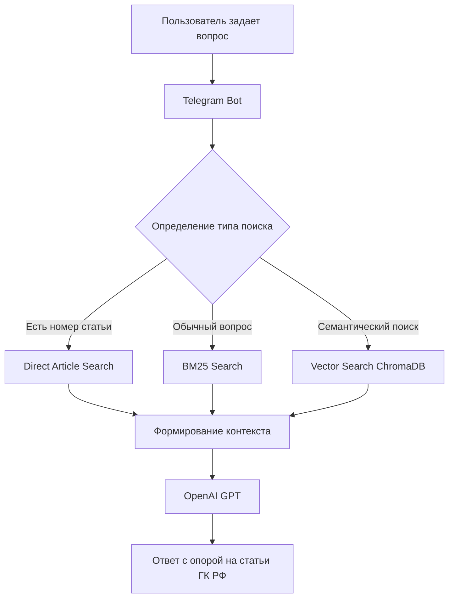

# ⚖️ Legal Consultation Bot

Telegram-бот для юридических консультаций на основе технологий **Retrieval-Augmented Generation (RAG)**. Бот использует **Гражданский кодекс Российской Федерации** в качестве базы знаний и отвечает на вопросы пользователей, опираясь на реальные статьи закона, а не только на знания языковой модели.

> ⚠️ Проект предназначен для информационных целей и не заменяет консультацию профессионального юриста.

---

# Возможности

- 📖 Поиск информации по Гражданскому кодексу РФ
- 🤖 Ответы на вопросы с использованием LLM
- 🔍 Гибридный поиск (Vector Search + BM25)
- 📌 Прямой поиск по номеру статьи
- 💬 Telegram-интерфейс
- ⚡ Быстрый локальный запуск

---

# Архитектура проекта

```

Пользователь
│
▼
Telegram Bot
│
▼
Обработка запроса
│
├── Поиск номера статьи
├── BM25 (полнотекстовый поиск)
└── Vector Search (ChromaDB)
│
▼
Формирование контекста
│
▼
OpenAI GPT
│
▼
Ответ пользователю
```




# Как работает RAG

При поступлении вопроса система выполняет несколько этапов.

### 1. Получение вопроса

Например:

> Какой срок исковой давности?

---

### 2. Поиск релевантных документов

Используются сразу несколько механизмов поиска:

- прямой поиск статьи;
- BM25;
- поиск по эмбеддингам в ChromaDB.

Такой подход позволяет находить как точные совпадения ("статья 196"), так и семантически похожие вопросы ("через сколько лет можно взыскать долг").

---

### 3. Формирование контекста

Из найденных документов собирается контекст, который передается языковой модели.

Модель отвечает **только на основании найденных статей**, что значительно снижает вероятность галлюцинаций.

---

# Почему используется RAG

Если просто задать вопрос LLM, модель отвечает на основе своих параметров.

```

Пользователь
↓

GPT

↓

Ответ

```

Такой подход может приводить к неточным или устаревшим ответам.

В данном проекте используется Retrieval-Augmented Generation.

```

Пользователь

↓

Поиск по базе знаний

↓

Релевантные статьи ГК РФ

↓

GPT

↓

Ответ

```

Благодаря этому модель получает актуальный юридический контекст перед генерацией ответа.

---

# Используемые технологии

| Технология | Назначение |
|------------|------------|
| Python | Backend |
| aiogram | Telegram Bot |
| OpenAI API | Генерация ответов |
| ChromaDB | Векторная база данных |
| BM25 | Полнотекстовый поиск |
| text-embedding-3-small | Создание эмбеддингов |
| structlog | Логирование |
| python-dotenv | Конфигурация |

---

# Почему ChromaDB

Для проекта была выбрана **ChromaDB**.

Причины выбора:

- простой локальный запуск;
- не требует отдельного сервера;
- хранение embeddings и metadata;
- высокая скорость поиска;
- отлично подходит для MVP и небольших проектов.

Для production можно рассмотреть:

- Qdrant
- pgvector
- Milvus

---

# Почему используется BM25

Векторный поиск отлично понимает смысл вопроса.

Однако запросы вида

> статья 196

или

> срок исковой давности

лучше находятся полнотекстовым поиском.

Поэтому используется **гибридный поиск**.

```

Запрос

↓

BM25

+

Vector Search

↓

Лучшие документы

```

Это позволяет увеличить полноту поиска (Recall) и снизить вероятность пропуска нужной статьи.

---

# Подготовка базы знаний

Перед запуском необходимо один раз проиндексировать Гражданский кодекс РФ.

```

knowledge_base/
└── gk_rf.txt

```

Затем выполнить

```bash
python ingest_data.py
```

Во время индексации происходит:

- чтение документа;
- разбиение на логические фрагменты;
- создание embeddings;
- сохранение в ChromaDB.

После этого база готова к работе.

---

# Структура проекта

```

bot_for_legal_consultations/

├── main.py                # Точка входа
├── bot.py                 # Telegram Bot
├── database.py            # Работа с ChromaDB и поиском
├── ingest_data.py         # Индексация базы знаний
├── prompts.py             # Prompt Engineering
├── config.py              # Настройки проекта
├── knowledge_base/
│   └── gk_rf.txt
├── chroma_db/             # Векторная база
└── requirements.txt

```

---

# Запуск проекта

## 1. Клонирование

```bash
git clone https://github.com/Alexsey111/bot_for_legal_consultations
cd bot_for_legal_consultations
```

---

## 2. Установка зависимостей

```bash
pip install -r requirements.txt
```

---

## 3. Создать `.env`

```env
OPENAI_API_KEY=...
BOT_TOKEN=...
```

---

## 4. Загрузить Гражданский кодекс РФ

```

knowledge_base/
└── gk_rf.txt

```

---

## 5. Проиндексировать базу

```bash
python ingest_data.py
```

---

## 6. Запустить бота

```bash
python main.py
```

---

# Возможные улучшения

Если развивать проект дальше, можно добавить:

- поддержку нескольких кодексов РФ;
- историю диалога;
- reranking результатов поиска;
- автоматическую оценку качества Retrieval;
- веб-интерфейс;
- голосовые сообщения;
- потоковую генерацию ответов;
- замену ChromaDB на Qdrant для production.

---

# Что демонстрирует проект

Проект демонстрирует практические навыки разработки AI-приложений:

- проектирование RAG-систем;
- работа с векторными базами данных;
- использование эмбеддингов;
- гибридный поиск (BM25 + Vector Search);
- интеграция OpenAI API;
- разработка Telegram-ботов;
- обработка и индексация документов;
- проектирование backend на Python.

---

# Лицензия

Проект создан исключительно в образовательных целях.
````
